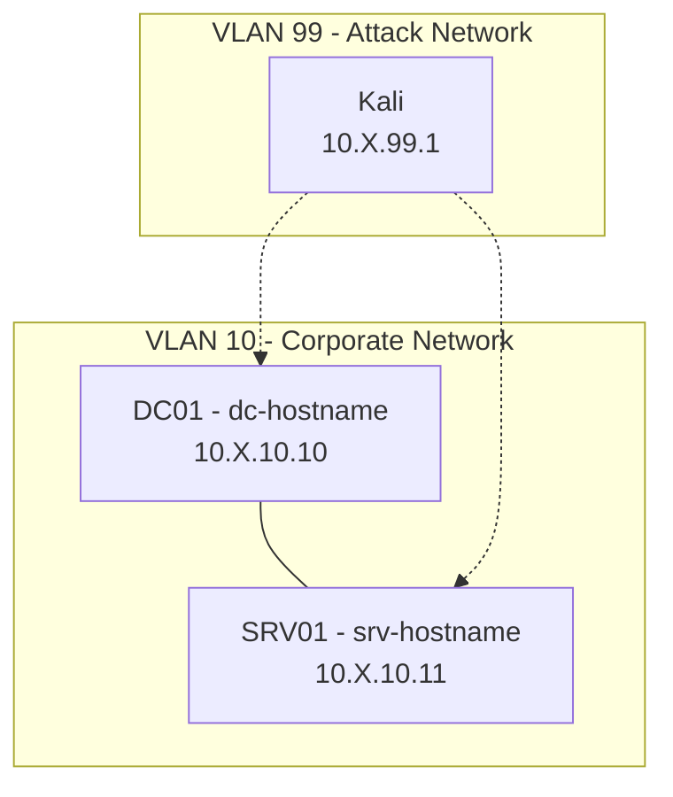

# Contributing to Ludus Range Configs

Thanks for contributing! This repo is a community collection of tested, ready-to-deploy range configurations for [Ludus](https://ludus.cloud).

## How to Submit a Range Config

1. **Fork** this repository
2. **Create a folder** named after your range (e.g., `my-ad-lab/`)
3. Add two files:
   - `range.yml` — Your Ludus range config
   - `README.md` — Documentation (see template below)
4. **Test your config** — Only submit configs that successfully deploy on Ludus
5. Open a **Pull Request** with a brief description

## Range Config Rules

### Must Have
- Use `{{ range_id }}` prefix in all `vm_name` fields for portability
- Use `{{ range_second_octet }}` for any IP references within `role_vars`
- All VMs must use templates from the [Ludus template list](https://docs.ludus.cloud/docs/templates)
- **No `router:` block** — Ludus auto-provisions the router
- Config must deploy successfully end-to-end

### Should Have
- Descriptive hostnames that match the lab theme
- `testing.snapshot: false` and `testing.block_internet: false` on attacker VMs (e.g., Kali)
- `sysprep: false` on DCs, `sysprep: true` on member servers

### Must NOT Have
- Hardcoded IPs (use `{{ range_second_octet }}` instead)
- Hardcoded range IDs (use `{{ range_id }}` instead)
- Real credentials or secrets (use lab-appropriate passwords)

## Range README Template

Use this template for your range's `README.md`:

````markdown
# Range Name

Brief description of what this range provides and what it's useful for.

## Network Diagram



> Replace `X` with your range's second octet (assigned by Ludus).

## VM Details

| VM Name | Hostname | Template | IP | Role | Description |
|---|---|---|---|---|---|
| `{{ range_id }}-DC01` | dc-hostname | win2022-server-x64-template | 10.X.10.10 | primary-dc | Domain controller for example.local |
| `{{ range_id }}-kali` | kali | kali-x64-desktop-template | 10.X.99.1 | linux | Attack box |

## Domains

| Domain | DC | Type |
|---|---|---|
| example.local | DC01 | Forest root |

## Required Templates

- `win2022-server-x64-template`
- `kali-x64-desktop-template`

## Required Ansible Roles

```bash
# Install required roles before deploying
ludus ansible role add badsectorlabs.ludus_adcs
```

## Credentials

| Account | Username | Password | Scope |
|---|---|---|---|
| Domain Admin | domainadmin | password | All domains (Ludus default) |

## Deployment

```bash
ludus range config set -f range.yml -r <RANGE_ID>
ludus range deploy -r <RANGE_ID>
ludus range logs -r <RANGE_ID> -f
```

Estimated deploy time: ~XX minutes

## Attack Paths

Brief description of what attack paths / techniques are available in this range.

## Acknowledgments

Credit any upstream projects, original authors, or inspirations here.
````

## Mermaid Diagram Guidelines

Every range README **must** include a Mermaid diagram. GitHub renders these natively.

### Structure
- Use `graph TB` (top-to-bottom) or `graph LR` (left-to-right)
- Group VMs by VLAN using `subgraph`
- Show domain relationships (trusts, child domains) with labeled edges
- Show attack paths with dashed lines (`-.->`)
- Include hostname, IP, and key services on each node
- Use `10.X.10.xx` notation (where X = range second octet)

### GitHub Compatibility Rules
- **No emoji** in node labels — GitHub's Mermaid renderer can fail on emoji characters
- **Use hyphens** (`-`) instead of em dashes (`—`) or unicode arrows (`→`, `↔`) in node text and edge labels
- **Keep node labels concise** — avoid long multi-line labels with many `<br/>` tags (4 lines max recommended)
- **Use named subgraph IDs** — write `subgraph VLAN10["VLAN 10 - Label"]` not `subgraph "VLAN 10 - Label"`
- **Avoid special unicode** in edge labels — stick to plain ASCII text in `|"label"|` blocks
- **Test locally** before submitting — use the [Mermaid Live Editor](https://mermaid.live/) to verify rendering

## Questions?

Open an issue or check [Ludus documentation](https://docs.ludus.cloud).
