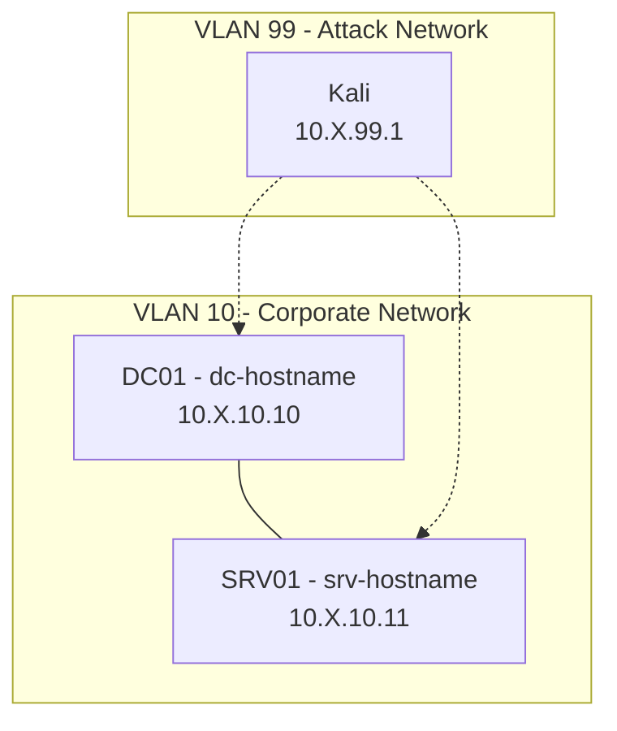

# Contributing to Ludus Range Configs

Thanks for contributing! This repo is a [Ludus source](https://docs.ludus.cloud/docs/using-ludus/sources) — a versioned bundle of blueprints that users can add with a single `ludus source add` command. Each blueprint is a complete, tested lab environment.

## How to Submit a Blueprint

1. **Fork** this repository
2. **Create a directory** under `blueprints/` named after your blueprint (e.g., `blueprints/my-ad-lab/`)
3. Add the required files (see layout below)
4. **Test your blueprint** — only submit configs that deploy successfully end-to-end
5. Open a **Pull Request** with a brief description

## Blueprint Directory Layout

```
blueprints/my-ad-lab/
├── blueprint.yml          Required — display metadata
├── range-config.yml       Required — the Ludus range configuration
├── requirements.yml       Optional — pinned Galaxy roles / off-Galaxy roles or collections
├── subscription_refs.yml  Optional — license-gated role names (delete if unused)
├── roles/                 Optional — Ansible roles only this blueprint needs
├── templates/             Optional — Packer templates only this blueprint needs
└── README.md              Required — documentation with diagram, VMs, attack paths
```

## `blueprint.yml` Required Fields

```yaml
manifest_version: 1          # always 1
id: my-ad-lab                 # unique within this source; lowercase, dashes
name: "My AD Lab"             # display name
description: "..."            # one-sentence summary
version: 0.1.0                # semver; bump on every change
config: range-config.yml      # path to range config, relative to this file
```

## `requirements.yml` Format

Uses standard `ansible-galaxy` requirements format. Supports both `roles:` and `collections:`:

```yaml
roles:
  - name: badsectorlabs.ludus_adcs
    src: https://github.com/badsectorlabs/ludus_adcs
    version: main

collections:
  - name: badsectorlabs.ludus_windows_utils
    version: ">=1.1.35"
```

Use `collections:` for anything installed with `ludus ansible collection add` (e.g., `mayyhem.ludus_sccm`, `badsectorlabs.ludus_windows_utils`). Use `roles:` for standalone roles installed with `ludus ansible role add`.

## Range Config Rules

### Must Have
- Use `{{ range_id }}` prefix in all `vm_name` fields for portability
- Use `{{ range_second_octet }}` for any IP references within `role_vars`
- All VMs must use templates from the [Ludus template list](https://docs.ludus.cloud/docs/templates)
- **No `router:` block** — Ludus auto-provisions the router
- Config must deploy successfully end-to-end

### Should Have
- Descriptive hostnames that match the lab theme
- `testing.snapshot: false` and `testing.block_internet: false` on attacker VMs (e.g., Kali)
- `sysprep: false` on DCs, `sysprep: true` on member servers

### Must NOT Have
- Hardcoded IPs (use `{{ range_second_octet }}` instead)
- Hardcoded range IDs (use `{{ range_id }}` instead)
- Real credentials or secrets (use lab-appropriate passwords)

## Blueprint README Template

Use this template for your blueprint's `README.md`:

````markdown
# Blueprint Name

Brief description of what this blueprint provides.

## Quick Start

```bash
ludus source add https://github.com/badsectorlabs/ludus-source-bsl
ludus blueprint apply ludus-source-bsl/my-ad-lab
ludus range deploy
```

## Network Diagram



> Replace `X` with your range's second octet (`ludus range list`).

## VM Details

| VM Name | Hostname | Template | IP | Role |
|---|---|---|---|---|
| `{{ range_id }}-DC01` | dc01 | win2022-server-x64-template | 10.X.10.10 | primary-dc |
| `{{ range_id }}-kali` | kali | kali-x64-desktop-template | 10.X.99.1 | attacker |

## Credentials

| Account | Username | Password | Scope |
|---|---|---|---|
| Domain Admin | domainadmin | password | All domains (Ludus default) |

## Attack Paths

Brief description of techniques available.

## Acknowledgments

Credit upstream projects, original authors, or inspirations here.
````

## Mermaid Diagram Guidelines

Every blueprint README **must** include a Mermaid diagram. GitHub and GitLab render these natively.

- Use `graph TB` (top-to-bottom) for most ranges
- Group VMs by VLAN using `subgraph`
- Show domain relationships (trusts, child domains) with labeled edges
- Show attack paths with dashed lines (`-.->`)
- Use `10.X.10.xx` notation (where X = range second octet)
- **No emoji** in node labels
- Use `subgraph VLAN10["VLAN 10 - Label"]` (named subgraph IDs)
- Test with the [Mermaid Live Editor](https://mermaid.live/) before submitting

## Questions?

Open an issue or check the [Ludus documentation](https://docs.ludus.cloud).
