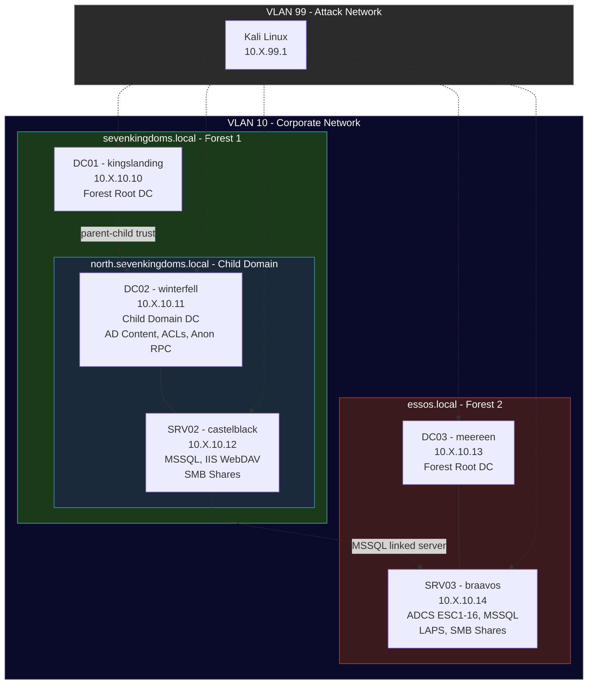

# GOAD — Game of Active Directory

A multi-domain, multi-forest Active Directory attack lab for [Ludus](https://ludus.cloud), based on [Orange Cyberdefense's GOAD](https://github.com/Orange-Cyberdefense/GOAD). Features 3 domains across 2 forests, ADCS with all ESC attack paths, MSSQL with impersonation/linked servers, LAPS, IIS WebDAV, child domain trusts, and dozens of AD misconfigurations.

## Network Diagram



> Replace `X` with your range's second octet (assigned by Ludus at deploy time).

## VM Details

| VM Name | Hostname | Template | IP | Domain | Role | Key Services |
|---|---|---|---|---|---|---|
| `{{ range_id }}-DC01` | kingslanding | `win2022-server-x64-template` | 10.X.10.10 | sevenkingdoms.local | primary-dc | Forest root DC |
| `{{ range_id }}-DC02` | winterfell | `win2022-server-x64-template` | 10.X.10.11 | north.sevenkingdoms.local | child-dc | Child domain DC, AD content, ACLs, anonymous RPC |
| `{{ range_id }}-SRV02` | castelblack | `win2022-server-x64-template` | 10.X.10.12 | north.sevenkingdoms.local | member | MSSQL, IIS WebDAV, SMB shares |
| `{{ range_id }}-DC03` | meereen | `win2022-server-x64-template` | 10.X.10.13 | essos.local | primary-dc | Separate forest DC |
| `{{ range_id }}-SRV03` | braavos | `win2022-server-x64-template` | 10.X.10.14 | essos.local | member | ADCS (all ESCs), MSSQL, LAPS |
| `{{ range_id }}-kali` | kali | `kali-x64-desktop-template` | 10.X.99.1 | — | attacker | Kali Linux |

## Domains

| Domain | DC | Forest | Type |
|---|---|---|---|
| `sevenkingdoms.local` | kingslanding (DC01) | Forest 1 | Forest root |
| `north.sevenkingdoms.local` | winterfell (DC02) | Forest 1 | Child domain |
| `essos.local` | meereen (DC03) | Forest 2 | Forest root |

## Resource Requirements

| Resource | Value |
|---|---|
| **Total RAM** | ~52 GB (8+8+6+8+6+16) |
| **Total vCPUs** | 22 (4+4+2+4+2+6) |
| **Windows VMs** | 5 |
| **Linux VMs** | 1 (Kali) |
| **Deploy time** | ~45–60 minutes |

## Required Templates

Build these templates before deploying:

```bash
ludus templates list   # verify these are BUILT
```

- `win2022-server-x64-template`
- `kali-x64-desktop-template`

## Required Ansible Roles & Collections

```bash
# Published roles (from Galaxy)
ludus ansible role add badsectorlabs.ludus_adcs

# Development roles (from ludus_windows_utils collection or local)
# These must be installed — check with: ludus ansible role list
#   ludus_child_domain
#   ludus_child_domain_join
#   ludus_ad_password_policy
#   ludus_bulk_ad_content
#   ludus_ad_acls
#   ludus_ad_misconfigs
#   ludus_ad_anonymous_rpc
#   ludus_smb_shares
#   ludus_files
#   ludus_iis_webdav
#   ludus_mssql
#   ludus_ad_laps
```

## Credentials

| Account | Username | Password | Scope |
|---|---|---|---|
| Domain Admin | `domainadmin` | `password` | All 3 domains (Ludus default) |
| Domain User | `domainuser` | `password` | All 3 domains (Ludus default) |
| MSSQL SA (castelblack) | `sa` | `YouWillNotKerboroast1ngMeeeeee` | NORTH\castelblack |
| MSSQL SA (braavos) | `sa` | `Admin123!` | ESSOS\braavos |
| ADCS CA Manager | `viserys.targaryen` | `GoldCrown` | essos.local |

## Deployment

```bash
# 1. Set the config
ludus range config set -f range.yml -r <RANGE_ID>

# 2. Deploy
ludus range deploy -r <RANGE_ID>

# 3. Monitor deployment
ludus range logs -r <RANGE_ID> -f

# 4. Check for errors
ludus range errors -r <RANGE_ID>

# 5. Verify all VMs are running
ludus range status -r <RANGE_ID>
```

## Attack Paths

This range provides a rich set of attack paths for offensive security training:

### Active Directory
- **Kerberoasting** — Service accounts with SPNs across both domains
- **AS-REP Roasting** — Accounts with pre-auth disabled
- **ACL Abuse** — GenericAll, WriteDacl, ForceChangePassword chains
- **Child → Parent Escalation** — Child domain trust abuse (SID history, golden ticket)
- **Anonymous Enumeration** — RPC null sessions on winterfell

### ADCS (braavos)
All ESC attack paths are configured:
- **ESC1** — Misconfigured certificate template (enrollee supplies subject)
- **ESC2** — Any Purpose EKU
- **ESC3** — Certificate request agent
- **ESC4** — Vulnerable certificate template ACL
- **ESC5** — Vulnerable PKI object ACL
- **ESC6** — EDITF_ATTRIBUTESUBJECTALTNAME2 flag
- **ESC7** — Vulnerable CA ACL (CA manager)
- **ESC8** — NTLM relay to HTTP enrollment
- **ESC9/ESC10** — No security extension / weak certificate mapping
- **ESC11** — NTLM relay to ICertPassage (RPC)
- **ESC13** — Issuance policy with group link
- **ESC14** — Weak explicit mapping
- **ESC15/ESC16** — Application policy abuse

### MSSQL (castelblack + braavos)
- **SA account access** — Mixed mode auth with known SA passwords
- **Impersonation** — `EXECUTE AS` chains (sa → samwell.tarly, jon.snow → brandon.stark)
- **Linked servers** — castelblack → braavos linked server (lateral movement via MSSQL)
- **Sysadmin escalation** — Service accounts with sysadmin role

### Other
- **LAPS** — LAPS configured on essos.local with readable passwords
- **IIS WebDAV** — Upload-enabled WebDAV on castelblack
- **SMB Shares** — Misconfigured shares with anonymous access
- **File artifacts** — Credential breadcrumbs and honeypot files

## Acknowledgments

- [GOAD](https://github.com/Orange-Cyberdefense/GOAD) by [@Mayfly277](https://github.com/Mayfly277) / [Orange Cyberdefense](https://github.com/Orange-Cyberdefense) — the original AD attack lab
- [Ludus](https://ludus.cloud) by [Bad Sector Labs](https://github.com/badsectorlabs) — the range platform
- [@ChoiSG](https://github.com/ChoiSG) — early [Ludus community roles](https://github.com/ChoiSG/ludus_ansible_roles)
