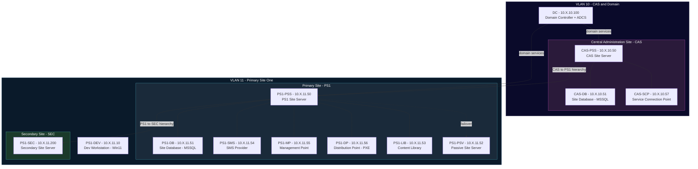

# SCCM — Ludus SCCM Hierarchy Lab

A full three-tiered Microsoft Configuration Manager (SCCM/MECM) hierarchy lab for [Ludus](https://ludus.cloud), based on [@Mayyhem's ludus_sccm](https://github.com/Mayyhem/ludus_sccm) project (which builds on [@Synzack's](https://github.com/Synzack/ludus_sccm) original work). Features a Central Administration Site (CAS), child primary site (PS1) with all site system roles on separate servers, a passive site server, and a secondary site — 13 VMs total, all domain-joined and auto-enrolled as SCCM clients.

This lab is vulnerable to **nearly all** attack techniques in [Misconfiguration Manager](https://github.com/subat0mern/Misconfiguration-Manager) (all except ELEVATE-4, ELEVATE-5, and TAKEOVER-9).

## Network Diagram



> Replace `X` with your range's second octet (assigned by Ludus at deploy time).

## VM Details

| VM Name | Hostname | Template | VLAN | IP | Domain Role | SCCM Role |
|---|---|---|---|---|---|---|
| `{{ range_id }}-dc` | dc | `win2022-server-x64-template` | 10 | 10.X.10.100 | primary-dc | Domain Controller + ADCS |
| `{{ range_id }}-cas-pss` | cas-pss | `win2022-server-x64-template` | 10 | 10.X.10.50 | member | CAS Primary Site Server |
| `{{ range_id }}-cas-db` | cas-db | `win2022-server-x64-template` | 10 | 10.X.10.51 | member | CAS Site Database (MSSQL + SSMS) |
| `{{ range_id }}-cas-scp` | cas-scp | `win2022-server-x64-template` | 10 | 10.X.10.57 | member | Service Connection Point |
| `{{ range_id }}-ps1-pss` | ps1-pss | `win2022-server-x64-template` | 11 | 10.X.11.50 | member | PS1 Primary Site Server |
| `{{ range_id }}-ps1-db` | ps1-db | `win2022-server-x64-template` | 11 | 10.X.11.51 | member | PS1 Site Database (MSSQL + SSMS) |
| `{{ range_id }}-ps1-psv` | ps1-psv | `win2022-server-x64-template` | 11 | 10.X.11.52 | member | Passive Site Server |
| `{{ range_id }}-ps1-lib` | ps1-lib | `win2022-server-x64-template` | 11 | 10.X.11.53 | member | Content Library |
| `{{ range_id }}-ps1-sms` | ps1-sms | `win2022-server-x64-template` | 11 | 10.X.11.54 | member | SMS Provider |
| `{{ range_id }}-ps1-mp` | ps1-mp | `win2022-server-x64-template` | 11 | 10.X.11.55 | member | Management Point |
| `{{ range_id }}-ps1-dp` | ps1-dp | `win2022-server-x64-template` | 11 | 10.X.11.56 | member | Distribution Point (PXE) |
| `{{ range_id }}-ps1-dev` | ps1-dev | `win11-22h2-x64-enterprise-template` | 11 | 10.X.11.10 | member | Dev Workstation |
| `{{ range_id }}-ps1-sec` | ps1-sec | `win2022-server-x64-template` | 11 | 10.X.11.200 | member | Secondary Site Server (MP + DP) |

## SCCM Hierarchy

| Site Code | Site Name | Type | Parent | Site Server | Key Systems |
|---|---|---|---|---|---|
| **CAS** | Central Administration Site | CAS | — | cas-pss | cas-db, cas-scp |
| **PS1** | Primary Site One | Primary | CAS | ps1-pss | ps1-db, ps1-sms, ps1-mp, ps1-dp, ps1-lib, ps1-psv, ps1-dev |
| **SEC** | Secondary Site | Secondary | PS1 | ps1-sec | (MP + DP on same server) |

## Domain

| Domain | DC | Notes |
|---|---|---|
| `mayyhem.com` | dc | ⚠️ **Do NOT use `.local` domains** — SCCM has known issues with `.local` suffixes |

## Resource Requirements

| Resource | Value |
|---|---|
| **Total RAM** | ~40 GB (4+4+2+4+4+2+2+2+2+4+4+4+4) |
| **Total vCPUs** | 38 (2+4+2+4+4+2+2+2+2+4+4+4+2) |
| **Windows VMs** | 13 (12× Win2022, 1× Win11) |
| **VLANs** | 2 (VLAN 10 + VLAN 11) |
| **Disk** | ~256 GB free recommended |
| **Deploy time** | ~90–120 minutes |

> ⚠️ This lab is **resource-intensive**. The author recommends 16+ CPU cores, 64+ GB RAM, and 256+ GB disk. You can reduce `ram_gb`/`cpus` or comment out optional VMs (e.g., `cas-scp`) to lower requirements.

## Required Templates

Build these templates before deploying:

```bash
ludus templates list   # verify these are BUILT
```

- `win2022-server-x64-template`
- `win11-22h2-x64-enterprise-template`

## Required Ansible Collection

```bash
# Install from Ansible Galaxy
ludus ansible collection add mayyhem.ludus_sccm
```

Or build from source:
```bash
git clone https://github.com/Mayyhem/ludus_sccm
cd ludus_sccm
ansible-galaxy collection build --force
# Copy to Ludus host and add via URL
ludus ansible collection add http://<your-ip>/mayyhem-ludus_sccm-1.0.0.tar.gz
```

## Credentials

| Account | Username | Password | Scope |
|---|---|---|---|
| Domain Admin | `domainadmin` | `password` | mayyhem.com (Ludus default) |

## Deployment

```bash
# 1. Install the collection
ludus ansible collection add mayyhem.ludus_sccm

# 2. Set the config
ludus range config set -f range.yml -r <RANGE_ID>

# 3. Deploy
ludus range deploy -r <RANGE_ID>

# 4. Monitor deployment
ludus range logs -r <RANGE_ID> -f

# 5. Check for errors
ludus range errors -r <RANGE_ID>
```

## Troubleshooting

Most deployment errors can be fixed by rebooting all VMs and retrying:

```bash
ludus power off -n all -r <RANGE_ID> && sleep 300 && ludus power on -n all -r <RANGE_ID> && sleep 300 && ludus range deploy -r <RANGE_ID>
ludus range logs -r <RANGE_ID> -f
```

If you've already passed initial VM setup, skip to role deployment:
```bash
ludus range deploy -r <RANGE_ID> -t user-defined-roles
```

## Attack Paths

This lab covers nearly all [Misconfiguration Manager](https://github.com/subat0mern/Misconfiguration-Manager) attack techniques:

### Credential Access
- **Network Access Account (NAA)** recovery
- **Task sequence** credential extraction
- **Client push** account abuse
- **MSSQL** site database access (sysadmin roles)

### Lateral Movement
- **Client push installation** abuse
- **PXE boot** media credential extraction
- **Distribution point** content access
- **SMS Provider** WMI abuse

### Privilege Escalation
- **Site server** to domain admin paths
- **Passive site server** failover abuse
- **ADCS** certificate-based attacks

### Site Takeover
- **CAS → Primary** hierarchy abuse
- **Primary → Secondary** hierarchy abuse
- **Site database** manipulation
- **SMS Provider** takeover

### Reconnaissance
- **Active Directory system/user/group discovery** enumeration
- **Site system role** enumeration
- **Client data** collection

> Excluded: ELEVATE-4, ELEVATE-5 (no PKI client auth required), TAKEOVER-9 (no linked databases with sysadmin)

## Acknowledgments

- [@Mayyhem](https://github.com/Mayyhem) — SCCM hierarchy lab expansion (CAS + secondary site)
- [@Synzack](https://github.com/Synzack) / [@kernel-sanders](https://github.com/kernel-sanders) — original [ludus_sccm](https://github.com/Synzack/ludus_sccm) project
- [Misconfiguration Manager](https://github.com/subat0mern/Misconfiguration-Manager) — SCCM attack technique reference
- [Ludus](https://ludus.cloud) by [Bad Sector Labs](https://github.com/badsectorlabs)
