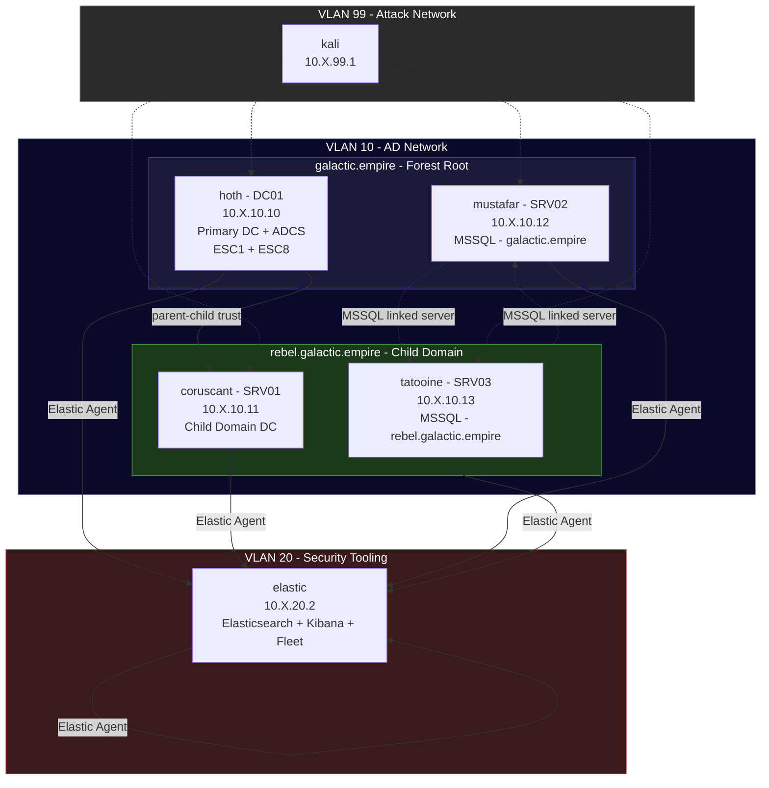

# AD + Elastic Security Range

A Star Wars-themed Active Directory attack lab with a full [Elastic Security](https://www.elastic.co/security) stack. Two-domain forest (`galactic.empire` root + `rebel.galactic.empire` child), ADCS with ESC1 and ESC8, two MSSQL servers with impersonation and cross-domain linked server paths, and Elastic Agent + Sysmon on every VM — including the Linux elastic server itself.

## Quick Start

```bash
ludus source add https://github.com/badsectorlabs/ludus-source-bsl
ludus blueprint apply ludus-source-bsl/ad-elastic-range
ludus range deploy
```

## Network Diagram



> Replace `X` with your range's second octet (`ludus range list`).

## VM Details

| VM Name | Hostname | Template | VLAN | IP | Role |
|---|---|---|---|---|---|
| `{{ range_id }}-elastic` | elastic | `debian-12-x64-server-template` | 20 | 10.X.20.2 | Elasticsearch + Kibana + Fleet |
| `{{ range_id }}-DC01` | hoth | `win2022-server-x64-template` | 10 | 10.X.10.10 | galactic.empire primary DC + ADCS |
| `{{ range_id }}-SRV01` | coruscant | `win2022-server-x64-template` | 10 | 10.X.10.11 | rebel.galactic.empire child DC |
| `{{ range_id }}-SRV02` | mustafar | `win2022-server-x64-template` | 10 | 10.X.10.12 | MSSQL (galactic.empire member) |
| `{{ range_id }}-SRV03` | tatooine | `win2022-server-x64-template` | 10 | 10.X.10.13 | MSSQL (rebel.galactic.empire member) |
| `{{ range_id }}-kali` | kali | `kali-x64-desktop-template` | 99 | 10.X.99.1 | Attacker |

## Domains

| Domain | DC | Type |
|---|---|---|
| `galactic.empire` | hoth (DC01) | Forest root |
| `rebel.galactic.empire` | coruscant (SRV01) | Child domain |

## Resource Requirements

| Resource | Value |
|---|---|
| **Total RAM** | ~46 GB |
| **Total vCPUs** | 22 |
| **Windows VMs** | 4 |
| **Linux VMs** | 2 (elastic + kali) |
| **Deploy time** | ~60–75 minutes |

## Access

| Service | URL / Address | Credentials |
|---|---|---|
| Kibana | `https://10.X.20.2:5601` | `elastic` / `ImperialFleet!` |
| Fleet Server | `https://10.X.20.2:8220` | — |
| hoth (RDP) | `10.X.10.10:3389` | `GALACTIC\domainadmin` / `password` |
| coruscant (RDP) | `10.X.10.11:3389` | `REBEL\domainadmin` / `password` |
| mustafar (RDP) | `10.X.10.12:3389` | `GALACTIC\domainadmin` / `password` |
| tatooine (RDP) | `10.X.10.13:3389` | `REBEL\domainadmin` / `password` |
| Kali | `10.X.99.1` | `kali` / `kali` |

## Lab Users

### galactic.empire

| Username | Password | Groups | Notes |
|---|---|---|---|
| `darth.vader` | `Th3F0rce!` | Domain Admins, Imperial Command | Primary DA — high-value target |
| `emperor.palpatine` | `Ord3r66!` | Domain Admins, Imperial Command | DA |
| `grand.moff.tarkin` | `D3athStar1` | Imperial Command, Death Star Crew | Can EXECUTE AS SA on mustafar |
| `moff.gideon` | `Mand4lorian!` | Imperial Fleet | Kerberoastable (HTTP SPN) |
| `agent.kallus` | `R3bels!` | Imperial Intelligence | AS-REP roastable — no pre-auth |
| `svc.deathstar` | `Sup3rL4ser!` | Death Star Crew | MSSQL sysadmin on mustafar, Kerberoastable (MSSQLSvc SPN) |
| `bounty.hunter` | `Carbonite1!` | Outer Rim Enforcers | GenericAll on Imperial Command → DA path |

### rebel.galactic.empire

| Username | Password | Groups | Notes |
|---|---|---|---|
| `luke.skywalker` | `Us3TheF0rce!` | Domain Admins (child), Jedi Order | Child domain DA |
| `han.solo` | `Kessel_Run12!` | Rogue Squadron | Kerberoastable (MSSQLSvc SPN on tatooine) |
| `princess.leia` | `Alderaan1!` | Rebel Alliance | Can EXECUTE AS SA on tatooine |
| `svc.rebel` | `R3sistance!` | — | MSSQL sysadmin on tatooine, Kerberoastable (MSSQLSvc SPN) |

### MSSQL SA Accounts

| Server | SA Password |
|---|---|
| mustafar | `D34thStar_SA!` |
| tatooine | `Reb3l_SA!` |

## Attack Paths

### Kerberoasting
```
moff.gideon      → HTTP/fleet.galactic.empire SPN → TGS → crack → Mand4lorian!
svc.deathstar    → MSSQLSvc/mustafar SPN           → TGS → crack → Sup3rL4ser!
han.solo         → MSSQLSvc/tatooine SPN           → TGS → crack → Kessel_Run12!
svc.rebel        → MSSQLSvc/tatooine SPN           → TGS → crack → R3sistance!
```

### AS-REP Roasting
```
agent.kallus → no Kerberos pre-auth → AS-REP hash → crack → R3bels!
```

### ACL Abuse
```
bounty.hunter --[GenericAll]--> Imperial Command (group)
  └─ Add bounty.hunter to Imperial Command
       └─ Imperial Command members have privileged access → DA escalation

agent.kallus --[ForceChangePassword]--> grand.moff.tarkin
  └─ Reset tarkin's password → MSSQL SA impersonation on mustafar
```

### ADCS
```
ESC1 — Enrollee-supplied SAN
  └─ Request cert for darth.vader (or any user) → authenticate as DA

ESC8 — NTLM relay to HTTP enrollment
  └─ Coerce DC01 (Print Spooler / WebClient) → relay to http://hoth/certsrv
       └─ Obtain DC machine cert → DCSync / PKINIT
```

### MSSQL Lateral Movement
```
mustafar (galactic.empire):
  svc.deathstar → sysadmin
  grand.moff.tarkin → EXECUTE AS sa → xp_cmdshell
  Linked server: MUSTAFAR → TATOOINE
    └─ svc.deathstar maps to SA on tatooine → cross-domain code execution

tatooine (rebel.galactic.empire):
  svc.rebel → sysadmin
  princess.leia → EXECUTE AS sa → xp_cmdshell
  Linked server: TATOOINE → MUSTAFAR
    └─ svc.rebel maps to SA on mustafar → cross-domain code execution
```

### NTLM Coercion
```
Print Spooler running on: hoth, coruscant, mustafar, tatooine
WebClient running on: mustafar, tatooine
  └─ PetitPotam / PrinterBug / DFSCoerce → relay to LDAP / ADCS
```

### Child Domain Escalation
```
rebel.galactic.empire → galactic.empire trust
  └─ Compromise child DA (luke.skywalker) → forge inter-realm TGT → DA on root
```

## Elastic Coverage

All 5 non-kali VMs run Elastic Agent + Sysmon:

| VM | OS | Sysmon |
|---|---|---|
| elastic (Debian 12) | Linux | No |
| hoth (Server 2022) | Windows | Yes |
| coruscant (Server 2022) | Windows | Yes |
| mustafar (Server 2022) | Windows | Yes |
| tatooine (Server 2022) | Windows | Yes |

After deploy, navigate to Kibana → Fleet → Agents to verify all 5 agents are enrolled and healthy.

## Acknowledgments

- [Ludus](https://ludus.cloud) by [Bad Sector Labs](https://github.com/badsectorlabs)
- [badsectorlabs.ludus_adcs](https://github.com/badsectorlabs/ludus_adcs)
- [badsectorlabs.ludus_mssql](https://github.com/badsectorlabs/ludus_mssql)
- [badsectorlabs.ludus_elastic_container](https://github.com/badsectorlabs/ludus_elastic_container)
- [badsectorlabs.ludus_elastic_agent](https://github.com/badsectorlabs/ludus_elastic_agent)

## License

AGPL-3.0-or-later — See [LICENSE](https://github.com/badsectorlabs/ludus-source-bsl/blob/main/LICENSE)
