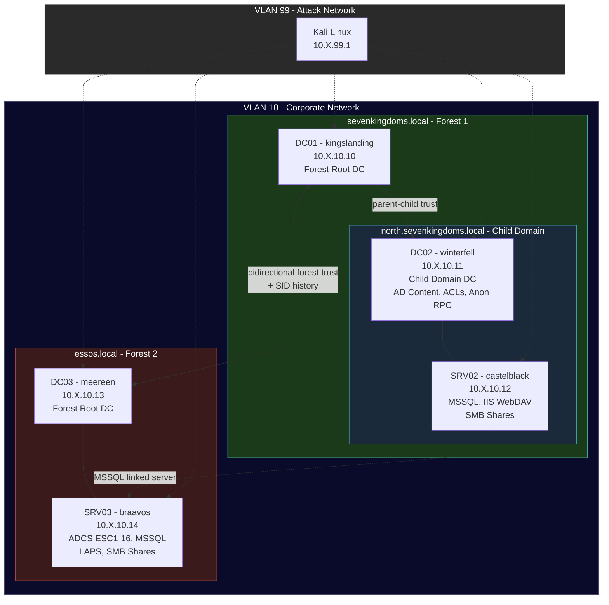

# GOAD — Game of Active Directory

A multi-domain, multi-forest Active Directory attack lab for [Ludus](https://ludus.cloud), based on [Orange Cyberdefense's GOAD](https://github.com/Orange-Cyberdefense/GOAD). Features 3 domains across 2 forests, ADCS with all ESC attack paths (ESC1-16), MSSQL with impersonation and linked servers, LAPS, gMSA, IIS WebDAV, anonymous RPC, bidirectional forest trusts, and dozens of AD misconfigurations including the full upstream GOAD ACL attack chain.

## Quick Start

```bash
ludus source add https://github.com/badsectorlabs/ludus-source-bsl
ludus blueprint apply ludus-source-bsl/goad
ludus range deploy
```

## Network Diagram



> Replace `X` with your range's second octet (`ludus range list`).

## VM Details

| VM Name | Hostname | Template | IP | Domain | Role |
|---|---|---|---|---|---|
| `{{ range_id }}-DC01` | kingslanding | `win2022-server-x64-template` | 10.X.10.10 | sevenkingdoms.local | Forest root DC |
| `{{ range_id }}-DC02` | winterfell | `win2022-server-x64-template` | 10.X.10.11 | north.sevenkingdoms.local | Child domain DC |
| `{{ range_id }}-SRV02` | castelblack | `win2022-server-x64-template` | 10.X.10.12 | north.sevenkingdoms.local | MSSQL, IIS WebDAV, SMB |
| `{{ range_id }}-DC03` | meereen | `win2022-server-x64-template` | 10.X.10.13 | essos.local | Separate forest DC |
| `{{ range_id }}-SRV03` | braavos | `win2022-server-x64-template` | 10.X.10.14 | essos.local | ADCS, MSSQL, LAPS |
| `{{ range_id }}-kali` | kali | `kali-x64-desktop-template` | 10.X.99.1 | — | Attacker box |

## Domains

| Domain | DC | Forest | Type |
|---|---|---|---|
| `sevenkingdoms.local` | kingslanding (DC01) | Forest 1 | Forest root |
| `north.sevenkingdoms.local` | winterfell (DC02) | Forest 1 | Child domain |
| `essos.local` | meereen (DC03) | Forest 2 | Forest root (bidirectional trust with Forest 1) |

## Resource Requirements

| Resource | Value |
|---|---|
| **Total RAM** | ~52 GB |
| **Total vCPUs** | 22 |
| **Windows VMs** | 5 |
| **Linux VMs** | 1 (Kali) |
| **Deploy time** | ~55–70 minutes |

## Credentials

| Account | Username | Password | Scope |
|---|---|---|---|
| Domain Admin | `domainadmin` | `password` | All 3 domains (Ludus default) |
| Domain User | `domainuser` | `password` | All 3 domains (Ludus default) |
| MSSQL SA (castelblack) | `sa` | `Sup1_sa_P@ssw0rd!` | north.sevenkingdoms.local |
| MSSQL SA (braavos) | `sa` | `sa_P@ssw0rd!Ess0s` | essos.local |
| ADCS CA Manager | `viserys.targaryen` | `GoldCrown` | essos.local |

## Attack Paths

### Active Directory

- **Kerberoasting** — `sansa.stark`, `jon.snow`, `sql_svc` (both domains) have SPNs
- **AS-REP Roasting** — `brandon.stark` (north), `missandei` (essos) have pre-auth disabled
- **ACL Abuse** — Full upstream GOAD chain: tywin→jaime→joffrey→tyron→SmallCouncil→DragonStone→KingsGuard→stannis→DC, plus essos chain (khal→viserys, missandei→khal, gmsaDragon→drogon)
- **Unconstrained Delegation** — `sansa.stark` (north)
- **Constrained Delegation** — `jon.snow` (any protocol), `castelblack$` (Kerberos-only)
- **Child → Parent Escalation** — SID history enabled on the trust
- **Anonymous Enumeration** — RPC null sessions on winterfell (north)
- **Cross-Domain Groups** — `AcrossTheNarrowSea`, `DragonsFriends`, `Spys` with cross-forest FSP members
- **LAPS** — `jorah.mormont` and `Spys` group can read braavos$ LAPS password
- **gMSA** — `gmsaDragon$` has GenericAll on `drogon` (essos DA escalation chain)

### ADCS (braavos — essos.local)

All ESC attack paths are configured via `badsectorlabs.ludus_adcs`:

| ESC | Technique |
|-----|-----------|
| ESC1 | Enrollee-supplied subject (any SAN) |
| ESC2 | Any Purpose EKU |
| ESC3 | Certificate Request Agent |
| ESC4 | `khal.drogo` has GenericAll on the ESC4 template |
| ESC5 | Vulnerable PKI object ACL |
| ESC6 | `EDITF_ATTRIBUTESUBJECTALTNAME2` flag on CA |
| ESC7 | `viserys.targaryen` has ManageCA rights |
| ESC8 | NTLM relay to HTTP enrollment |
| ESC9 | No security extension |
| ESC10 | Weak certificate mapping (KDC registry + Schannel) |
| ESC11 | `IF_ENFORCEENCRYPTICERTREQUEST` disabled |
| ESC13 | Issuance policy with group link (`greatmaster`) |
| ESC14 | Weak explicit mapping |
| ESC15 | Web Server template enrollable by Domain Users |
| ESC16 | Application policy abuse |

### MSSQL (castelblack + braavos)

- **Linked servers** — castelblack → braavos (jon.snow maps to sa on braavos; khal.drogo maps to sa on castelblack)
- **Impersonation** — `EXECUTE AS` chains on castelblack (sa→samwell.tarly, jon.snow→brandon.stark; arya.stark→dbo in master+msdb)
- **Sysadmin** — `jon.snow` (castelblack), `khal.drogo` (braavos)

### Other

- **IIS WebDAV** — Upload-enabled on castelblack (NTLM coercion surface)
- **SMB Shares** — Anonymous access on castelblack and braavos
- **SYSVOL Disclosure** — `script.ps1` contains `jeor.mormont` credentials
- **Credential Breadcrumbs** — `arya.txt` in castelblack all-share

## Validation

After deploy, run the included test suite to verify 100% coverage:

```bash
cd blueprints/goad/testing
python3 validate_goad.py
python3 -m pytest test_goad.py -v
```

Expected: **186/186** checks passing, **140/140** pytest tests passing.

## Acknowledgments

- [GOAD](https://github.com/Orange-Cyberdefense/GOAD) by [@Mayfly277](https://github.com/Mayfly277) / [Orange Cyberdefense](https://github.com/Orange-Cyberdefense)
- [DreadGOAD](https://github.com/dreadnode/DreadGOAD) by [Dreadnode](https://github.com/dreadnode) — ACL implementation reference
- [Ludus](https://ludus.cloud) by [Bad Sector Labs](https://github.com/badsectorlabs)

## License

AGPL-3.0-or-later — See [LICENSE](https://github.com/badsectorlabs/ludus-source-bsl/blob/main/LICENSE)
