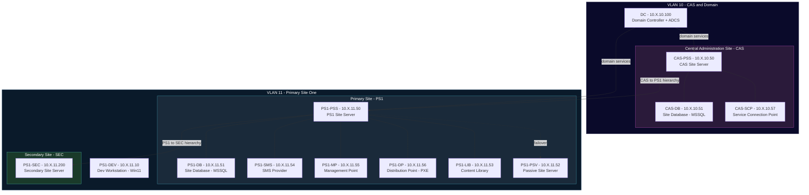

# SCCM — Microsoft Configuration Manager Hierarchy Lab

A full three-tiered Microsoft Configuration Manager (SCCM/MECM) hierarchy lab for [Ludus](https://ludus.cloud), based on [@Mayyhem's ludus_sccm](https://github.com/Mayyhem/ludus_sccm) (which builds on [@Synzack's](https://github.com/Synzack/ludus_sccm) original work). Features a Central Administration Site (CAS), child Primary Site (PS1) with all site system roles on dedicated servers, a Passive Site Server, and a Secondary Site — 13 Windows VMs total, all domain-joined and auto-enrolled as SCCM clients.

This lab is vulnerable to **nearly all** attack techniques in [Misconfiguration Manager](https://github.com/subat0mern/Misconfiguration-Manager).

## Quick Start

```bash
ludus source add https://github.com/badsectorlabs/ludus-range-configs
ludus blueprint apply ludus-range-configs/sccm
ludus range deploy
```

## Network Diagram



> Replace `X` with your range's second octet (`ludus range list`).

## VM Details

| VM Name | Hostname | Template | VLAN | IP | SCCM Role |
|---|---|---|---|---|---|
| `{{ range_id }}-dc` | dc | `win2022-server-x64-template` | 10 | 10.X.10.100 | Domain Controller + ADCS |
| `{{ range_id }}-cas-pss` | cas-pss | `win2022-server-x64-template` | 10 | 10.X.10.50 | CAS Site Server |
| `{{ range_id }}-cas-db` | cas-db | `win2022-server-x64-template` | 10 | 10.X.10.51 | CAS Site Database (MSSQL + SSMS) |
| `{{ range_id }}-cas-scp` | cas-scp | `win2022-server-x64-template` | 10 | 10.X.10.57 | Service Connection Point |
| `{{ range_id }}-ps1-pss` | ps1-pss | `win2022-server-x64-template` | 11 | 10.X.11.50 | PS1 Site Server |
| `{{ range_id }}-ps1-db` | ps1-db | `win2022-server-x64-template` | 11 | 10.X.11.51 | PS1 Site Database (MSSQL + SSMS) |
| `{{ range_id }}-ps1-psv` | ps1-psv | `win2022-server-x64-template` | 11 | 10.X.11.52 | Passive Site Server |
| `{{ range_id }}-ps1-lib` | ps1-lib | `win2022-server-x64-template` | 11 | 10.X.11.53 | Content Library |
| `{{ range_id }}-ps1-sms` | ps1-sms | `win2022-server-x64-template` | 11 | 10.X.11.54 | SMS Provider |
| `{{ range_id }}-ps1-mp` | ps1-mp | `win2022-server-x64-template` | 11 | 10.X.11.55 | Management Point |
| `{{ range_id }}-ps1-dp` | ps1-dp | `win2022-server-x64-template` | 11 | 10.X.11.56 | Distribution Point (PXE) |
| `{{ range_id }}-ps1-dev` | ps1-dev | `win11-22h2-x64-enterprise-template` | 11 | 10.X.11.10 | Dev Workstation |
| `{{ range_id }}-ps1-sec` | ps1-sec | `win2022-server-x64-template` | 11 | 10.X.11.200 | Secondary Site Server |

## SCCM Hierarchy

| Site Code | Site Name | Type | Parent | Site Server |
|---|---|---|---|---|
| **CAS** | Central Administration Site | CAS | — | cas-pss |
| **PS1** | Primary Site One | Primary | CAS | ps1-pss |
| **SEC** | Secondary Site | Secondary | PS1 | ps1-sec |

## Domain

| Domain | DC | Notes |
|---|---|---|
| `mayyhem.com` | dc | ⚠️ Do NOT use `.local` — SCCM has known issues with `.local` suffixes |

## Resource Requirements

| Resource | Value |
|---|---|
| **Total RAM** | ~40 GB |
| **Total vCPUs** | 38 |
| **Windows VMs** | 13 (12× Server 2022, 1× Win11) |
| **VLANs** | 2 (VLAN 10 + VLAN 11) |
| **Disk** | ~256 GB free recommended |
| **Deploy time** | ~90–120 minutes |

> ⚠️ Resource-intensive. Recommended: 16+ CPU cores, 64+ GB RAM, 256+ GB disk.

## Credentials

| Account | Username | Password | Scope |
|---|---|---|---|
| Domain Admin | `domainadmin` | `password` | mayyhem.com (Ludus default) |

## Attack Paths

This lab covers nearly all [Misconfiguration Manager](https://github.com/subat0mern/Misconfiguration-Manager) techniques:

### Credential Access
- **Network Access Account (NAA)** recovery from WMI
- **Task sequence** variable/credential extraction
- **Client push** account credential abuse
- **MSSQL** site database sysadmin access

### Lateral Movement
- **Client push installation** coercion
- **PXE boot** unattended media credential extraction
- **Distribution point** content browsing and download
- **SMS Provider** WMI method abuse

### Privilege Escalation
- **Site server** to Domain Admin escalation paths
- **Passive site server** failover abuse
- **ADCS** certificate-based privilege escalation

### Site Takeover
- **CAS → Primary** hierarchy control abuse
- **Primary → Secondary** propagation abuse
- **Site database** direct manipulation
- **SMS Provider** full takeover

### Reconnaissance
- Active Directory system, user, and group discovery
- Site system role enumeration
- SCCM client data collection

> **Excluded:** ELEVATE-4, ELEVATE-5 (no PKI client auth required), TAKEOVER-9 (no linked databases with sysadmin)

## Troubleshooting

Most deployment errors resolve with a power cycle and retry:

```bash
ludus power off -n all -r <RANGE_ID>
sleep 300
ludus power on -n all -r <RANGE_ID>
sleep 300
ludus range deploy -r <RANGE_ID>
```

For partial deploys (past initial VM setup), use:

```bash
ludus range deploy -r <RANGE_ID> -t user-defined-roles
```

## Acknowledgments

- [@Mayyhem](https://github.com/Mayyhem) — SCCM hierarchy lab (CAS + secondary site expansion)
- [@Synzack](https://github.com/Synzack) / [@kernel-sanders](https://github.com/kernel-sanders) — original [ludus_sccm](https://github.com/Synzack/ludus_sccm)
- [Misconfiguration Manager](https://github.com/subat0mern/Misconfiguration-Manager) — SCCM attack technique reference
- [Ludus](https://ludus.cloud) by [Bad Sector Labs](https://github.com/badsectorlabs)

## License

AGPL-3.0-or-later — See [LICENSE](https://github.com/badsectorlabs/ludus-range-configs/blob/main/LICENSE)
